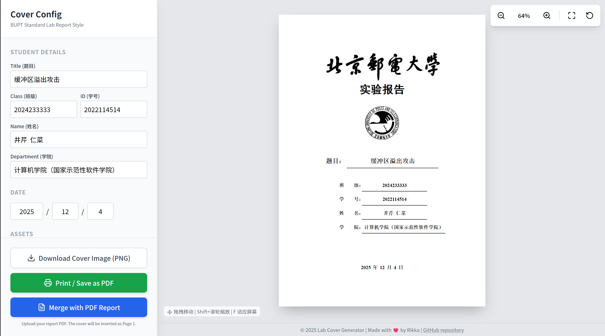

# BUPT Lab Cover Generator

北京邮电大学实验报告封面生成器 - 快速生成标准格式的实验报告封面，直接插入到你的 PDF 报告文件首页。



## ✨ 功能特性

- 📝 **表单填写**：支持填写题目、班级、学号、姓名、学院等信息
- 📅 **自动日期**：默认填充当前日期
- 🔍 **实时预览**：所见即所得的预览效果
- 🖱️ **缩放控制**：支持拖拽移动、滚轮缩放、适应屏幕等操作
- 🖨️ **打印导出**：使用浏览器原生打印功能导出 PDF，保证渲染准确
- 📄 **PDF 合并**：可将生成的封面与已有 PDF 文件合并
- 🖼️ **图片导出**：支持导出 PNG 格式图片

## 🚀 快速开始

### 在线使用

链接：<https://cover.r1kka.one/>

### 安装依赖

```bash
pnpm install
```

### 开发模式

```bash
pnpm dev
```

## 📖 使用说明

1. 在左侧表单中填写实验报告相关信息
2. 右侧实时预览封面效果
3. 使用缩放控件调整预览大小：
   - 拖拽移动预览
   - `Shift + 滚轮` 缩放
   - 按 `F` 适应屏幕
   - 按 `0` 重置视图
4. 选择导出方式：
   - **Print / Save as PDF**：使用浏览器打印功能导出 PDF
   - **Download Cover Image**：导出 PNG 图片
   - **Upload PDF to Merge**：上传已有 PDF，将封面插入首页

## 📁 项目结构

```
lab-cover-generator/
├── assets/              # 静态资源（校徽、校名图片）
├── components/          # React 组件
│   ├── CoverPreview.tsx    # 封面预览组件
│   ├── Sidebar.tsx         # 侧边栏表单组件
│   ├── SmartUnderline.tsx  # 智能下划线组件
│   └── ZoomablePreview.tsx # 可缩放预览组件
├── services/            # 服务
│   └── pdfService.ts       # PDF 生成与合并服务
├── App.tsx              # 主应用组件
├── index.tsx            # 入口文件
├── types.ts             # TypeScript 类型定义
└── vite.config.ts       # Vite 配置
```

## 🛠️ 技术栈

- **React 19** - 用户界面
- **TypeScript** - 类型安全
- **Vite** - 构建工具
- **Tailwind CSS** - 样式框架
- **html2canvas** - HTML 转图片
- **jsPDF** - PDF 生成
- **pdf-lib** - PDF 合并
- **Lucide React** - 图标库


## 🙏 致谢

- 北京邮电大学
- 所有贡献者

---

Made with ❤️ for BUPT students
